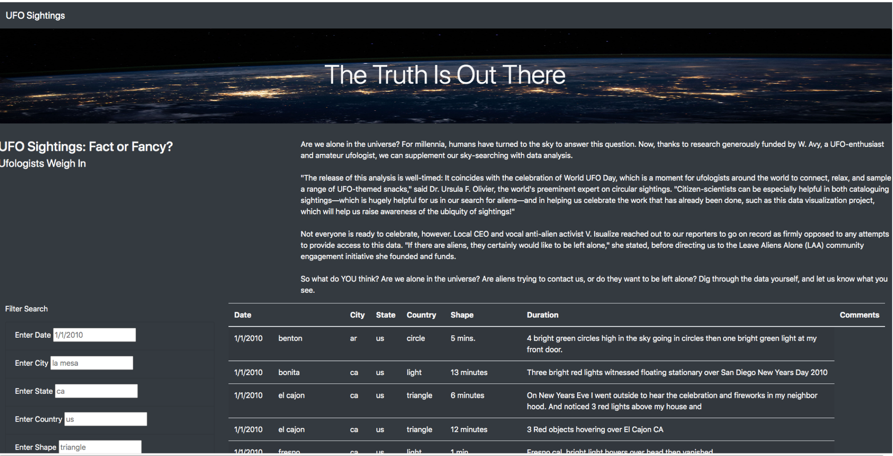

# UFOs

## Overview 

The objective of the analysis is to build a table using data stored in a JavaScript array, create filters to make the table fully dynamic and place it into a HTML file for easy viewing. In addition, the webpage was customized using Bootstrap and the table equipped with multiple criteria filters that will allow to interact with the visualizations.

---
## Results

Image below shows the HTML page. Filters are located on the bottom left of the page.

Summary of How to perform the search 
To perform the search, the user should fill in the different criterias correspondent to Date, City, State, Country and Shape and press enter  

---
## Summary

The recomendations to the CEO would be to increase the amount of drivers in rural and suburban cities in order to supply the ride demand in those cities therefore reduce the average fare per ride and driver.  

---
